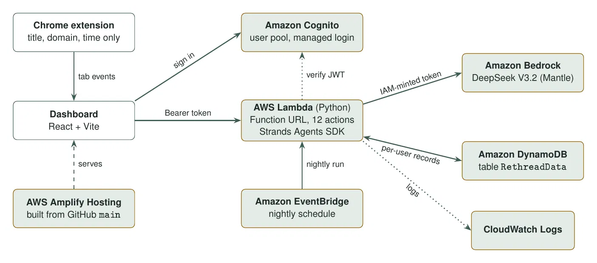

# Rethread

**Getting back into the work after an interruption: an n-of-1 support tool for ADHD executive function, built on AWS**

**Team:** Anirban Biswas (agents, backend) · Manideep Rudroju (UI, deployment), Nenavath Rathan(UI/UX)
**Track:** Ship It · **Live:** <https://main.d16k496u63q21s.amplifyapp.com> · **Code:** <https://github.com/manideeprudroju/rethread>

---

## The idea

ADHD is, in Russell Barkley’s framing, a disorder of *performance at the point of performance*, not of knowledge. People know what they should be doing. What breaks is the moment of doing it: starting, and getting back in after an interruption. An interruption wipes working memory: which goal was active, which tabs mattered, what the next concrete step was. Reconstructing that costs minutes, and often the session just ends.

Most tools answer with reminders, streaks and advice, which tell people what they already know and add a failure count on top. Rethread does the opposite: it **lowers the cost of starting and restarting**, and it **learns what helps this one person** through a proper single-case experiment instead of generic tips.

It is a Chrome extension plus a web dashboard:

- **Re-entry (the core).** When you come back to a session, Rethread rebuilds what you were doing, the tabs that matter and the next concrete action, from the session’s goal and its tab titles.

- **A first move, not a to-do list.** You say what you are working on, where it lives and when it is due. You get one small first action and a couple of if-then plans (implementation intentions) for the moments it gets stuck. A short chat adjusts them mid-session.

- **Your own experiment.** Each session is assigned by the server to one of two conditions: the first step with its if-then plans shown, or the first step with the plans one click away. Rethread measures how long each session takes to get going and reports only once an exact statistical test says there is a real difference.

- **Friction check and guide.** Once a day it looks for recurring patterns in the past week (slow starts, circling back to the same page, rechecking, spreading across too many tabs) and offers one evidence-based if-then plan for the next session. A small guide chat answers questions only from trusted sources (NIMH, NHS, Tele-MANAS and the research behind the plans).

### Design rules we held to

- **Support, not assessment.** No screening, no diagnosis, no severity scores, no medication content, no repurposed rating scales. A clinician stays the decision-maker; the output is objective data the user owns and can choose to share.

- **No shame loop.** No streaks, no red, no failure framing. A missed session is a data point about conditions, not a verdict on the person. Every model output that reaches the user is checked for language about the person (“you struggle with…”) and rejected if it appears.

- **Privacy by design.** The extension captures only tab title, domain and time, never page content. The tab timeline is never stored on the server, and experiment records hold measurements only.

- **Nothing is called “working” before the evidence says so.** This is the rule the whole experiment loop is built around.

## Architecture



**Request path.** The extension (Manifest V3) records a tab title, domain and timestamp whenever the active tab changes, skips browser pages and the dashboard itself, and hands each event straight to the open dashboard. Nothing goes to a server at this point. The dashboard is a React app served by **AWS Amplify Hosting**, built from the GitHub `main` branch. Users sign in through **Amazon Cognito** (managed login, authorization-code flow), and every call to the backend carries the Cognito access token.

**One Lambda, many agents.** The backend is a single **AWS Lambda** function behind a **Lambda Function URL**, with CORS locked to the Amplify origin. One action-routed handler serves twelve actions (first move, drift, churn, re-entry, session chat, assign, log session, nightly, friction, feels-heavy, guide and the opening turn). Every request is authenticated inside the handler: the Cognito access token is verified (RS256, against the user pool’s public keys), and the user’s identity is taken from the token, never from the request body. So nothing the browser sends can read or pick another user’s data.

**Models.** Agents are built with the **Strands Agents SDK** and run on **Amazon Bedrock**. Because the account’s Bedrock Converse endpoint was blocked, we run through Bedrock’s OpenAI-compatible Mantle endpoint with **DeepSeek V3.2**, which scored 92% on our labelled drift test set. The Lambda mints short-lived Bedrock tokens from its own IAM role, so no model API key exists anywhere in code or config. A single model map assigns a model per agent role; one environment variable switches every role to Bedrock Converse, where the map already tiers **Claude Haiku 4.5** for the high-volume roles and **Claude Sonnet 4.5** for reasoning.

**Memory that lasts weeks, not one conversation.** State lives in one **Amazon DynamoDB** table keyed by user: `SESSION#` items hold the live session the chat agent works from, `EXP#` items hold each finished session’s measurements, and `NIGHTLY#latest` holds the latest analysis. Agents themselves are stateless: every call starts with an empty conversation (`agent.messages.clear()`), so a warm Lambda never carries one user’s tabs into another user’s call, and token use does not grow over time.

**Nightly reflection.** An **Amazon EventBridge** schedule invokes the same Lambda every night. It finds every user with logged sessions, runs the experiment gate on each, and, only if the gate clears, asks the analyst agent to write the result. Results are stored in DynamoDB, and the dashboard’s nightly summary runs the same analysis on demand. Logs go to **CloudWatch**.

### AWS services and why each one is there

| **Service** | **What it does in Rethread** | **Why this choice** |
|---|---|---|
| AWS Amplify Hosting | Builds and serves the dashboard from GitHub on every push | Static site on a CDN: no servers, near-zero cost, deploys on push |
| Amazon Cognito | Sign-in, access tokens, one identity per user | Per-user data separation without writing auth ourselves |
| AWS Lambda + Function URL | One action-routed handler for every agent | One deploy unit, no idle cost, one warm container serves all actions; no API Gateway needed |
| Amazon Bedrock | Every language step: first move, re-entry, chat, drift, analyst, friction plan, guide | Managed models; IAM-minted tokens, so no API keys; per-role model map |
| Strands Agents SDK | Builds each agent from a role, a prompt and a model | Same code on Mantle or Converse; one line to change provider |
| Amazon DynamoDB | Sessions, experiment records, nightly results, keyed by user | Durable cross-session memory with no servers and no schema migrations |
| Amazon EventBridge | Runs the nightly analysis for every user | A schedule instead of an always-on worker |
| AWS IAM | Lambda role limited to Bedrock, its own logs and the one table | Least privilege |
| Amazon CloudWatch | Handler and agent logs | Debugging a live system without extra tooling |

## The agents, and why each one earns its place

The rule we built with: **use a model only where language is needed, and compute everything else.** Statistics, pattern detection, safety routing and search are plain code. Where a model is used, its output is checked before anyone sees it, and there is always an honest fallback.

| **Agent / step** | **Job** | **Model calls** | **Check before it is shown** |
|---|---|---|---|
| First move | One concrete first action and if-then plans from the goal | 1 | Grounding and banned-phrase validator; safe template fallback |
| Session chat | Adjusts the step mid-session; carries its own history in the session object | 1 per turn | Must not invent files or names the user never mentioned |
| Drift | Is this tab part of the declared work? Used to measure time to start | 1 per new tab | Fails open: a failed call never counts as a lapse |
| Churn | Staying on the work but spinning | 0 | Deterministic |
| Re-entry | Rebuilds goal, key tabs and next action after an interruption | 1 | No focus or drift language, nothing about the person, every key tab traced to a real event |
| Experiment gate | Assigns conditions; decides if one really helps | 0 | Exact permutation test, 8 sessions per condition |
| Analyst | Writes up a result the gate cleared | 1, only after the gate clears | No trait claims, no causes, no overstating |
| Friction | Finds recurring patterns; picks one plan from a 10-entry evidence base | 0 on a quiet day, else 1 | Validator, one repair, template fallback |
| Guide | Answers questions from a fixed index of trusted sources | 0 for safety replies, else 1 | Safety routing runs first; replies checked for assessment and medication talk |

### The experiment loop (where the rigour lives)

Single-case experimental design is a real clinical research method, and we treated it that way. The server assigns each session’s condition in **balanced, shuffled blocks** seeded by the user’s Cognito id, so the conditions cannot line up with the person’s routine (mornings versus evenings), which simple alternation would. The outcome is **initiation latency**: seconds from starting a session to the first tab that is actually part of the work, as judged by the drift agent. A failed check is recorded as missing, never as a start.

Nothing is reported until each condition has **8 sessions**. Then an **exact permutation test** ($\alpha = 0.05$) decides. The result is one of three honest answers: *still learning*, *no clear difference*, or a finding. Only a finding reaches the analyst agent, whose wording is validated before it is shown. There is no code path from data to a user-facing claim that skips the gate.

### Friction check and guide

The browser sends the past week of tab events for this one check (they are never stored on the server). The Lambda runs four deterministic detectors, and breaks each episode into before, during and after, in clock times only. It then picks one support from a 10-entry knowledge base (each with its mechanism, the paper behind it, and when a clinician would *not* use it) and asks the model for one if-then plan for the next session. If the person marks a plan as “not this kind of step”, it is never offered again. Which plan works is itself run as a small experiment with the same gate. A one-tap “this one feels heavy” gives a plan in the moment, only when the person says so.

The guide answers from a fixed index (NIMH, NHS adults, Tele-MANAS, emergency number 112, the four papers behind the plans, and our own explainers) using BM25 search in the Lambda: no vector database, no web search. Before any model call, a safety router handles self-harm (Tele-MANAS 14416 and 112), medication questions (a doctor) and “do I have ADHD?” (only a specialist assessment can say). Those replies are fixed text with no model call.

## Cost and efficiency decisions

- **Deterministic first.** The experiment gate, the four friction detectors, churn, safety routing and guide search cost zero tokens. On a quiet day the friction check makes no model call at all; the analyst runs only when the gate clears, which needs at least 16 logged sessions.

- **The highest-volume path is bounded.** Drift is called once per distinct tab (unread counters ignored), cached in the browser, stops as soon as the first on-task tab is found, and is capped at 50 calls per session. It returns plain text, one call per tab rather than a structured-output round trip.

- **Stateless agents.** Clearing agent history on every call keeps prompts small and constant, no matter how long a Lambda container stays warm, and keeps users isolated.

- **One function, no gateway.** A single Lambda behind a Function URL means one deployment, no idle cost and no API Gateway charges. A cold start is paid once for all twelve actions.

- **Scheduled, not always on.** The nightly analysis is one EventBridge-triggered run, not a worker waiting for work.

- **Less data is cheaper and safer.** The tab timeline is never stored on the server; experiment records hold measurements only.

- **Model choice is configuration.** Each agent role has its own model entry, overridable by environment variable, so a cheaper model can be tried on one role (drift first) and measured against the 92% baseline without touching code.

## Security and privacy

- Every request is authenticated in the Lambda with the Cognito access token; identity comes from the token, never the body.

- CORS on the Function URL allows only the Amplify site (and localhost for development).

- No model API keys: Bedrock tokens are minted at run time from the Lambda’s IAM role, and the role can reach only Bedrock, its own logs and the one DynamoDB table.

- Captured data is tab title, domain and time. Page content is never read. Browser storage is kept separately for each signed-in user.

- Experiment records are measurements only: goal, location and due date are stripped before logging. The chat session’s record (goal, plans, chat turns) is stored under the user’s id so the agent can pick the session up again.

## How we tested it

Each agent has a probe script with labelled cases; the drift probe’s labelled set is where the 92% figure comes from. The friction (60) and guide (44) checks run without AWS, against the project’s shared validators. A local check drives the real Lambda handler end to end with fake auth and a fake model, confirms every agent call starts with an empty history, and confirms every module the handler imports is in the deployment package. The deploy script refuses to ship if a module is missing or the friction and guide checks fail, then smoke-tests the live function: the auth gate, the nightly EventBridge path with real DynamoDB access, and, with a token, the friction and guide actions.

## Run it yourself

**Live:** <https://main.d16k496u63q21s.amplifyapp.com> (sign in, then add `?demo=1` to the URL and reload to see the Friction panel with a sample week).

**Dashboard (`frontend/`)**
```
cd frontend
npm ci
echo VITE_LAMBDA_URL=<your Lambda Function URL> > .env.local
npm run dev
```
Open <http://localhost:5173>. Cognito settings default to the project's pool in `src/authConfig.js` and can be overridden with `VITE_COGNITO_AUTHORITY` and `VITE_COGNITO_CLIENT_ID`.

**Extension**
Open `chrome://extensions`, turn on Developer mode, choose **Load unpacked** and select the extension folder. The dashboard's URL must be listed in its `manifest.json` under `content_scripts.matches` and `host_permissions`.

**Backend (Lambda)**
Needs the AWS CLI configured and Python 3.12. From the backend folder:
```
pip install boto3 "PyJWT[crypto]" pydantic
python local_check.py
deploy.bat
```
`local_check.py` runs the friction and guide checks and drives the real handler end to end with fake auth and a fake model, with no AWS needed. `deploy.bat` packages the modules, deploys `rethread-agents` and smoke-tests it. CORS for the Function URL is in `cors.json`, and the nightly run is an EventBridge rule (`rethread-nightly`) targeting the function.

## What is next

- **Time-limited clinician sharing** with Cedar policies: a user grants a clinician read access to their experiment data for a set period and can revoke it at any time.

- **Step Functions** for a weekly experiment cycle that fans out per user, replacing the nightly scan as the number of users grows.

- **Model tiering in practice:** move drift to a smaller Bedrock model once it matches the 92% baseline, and switch to Claude on Bedrock Converse when the account allows it.

- **More conditions to test:** session length, time of day and deadline framing.

- **Full export and delete** of a user’s data from the dashboard.
